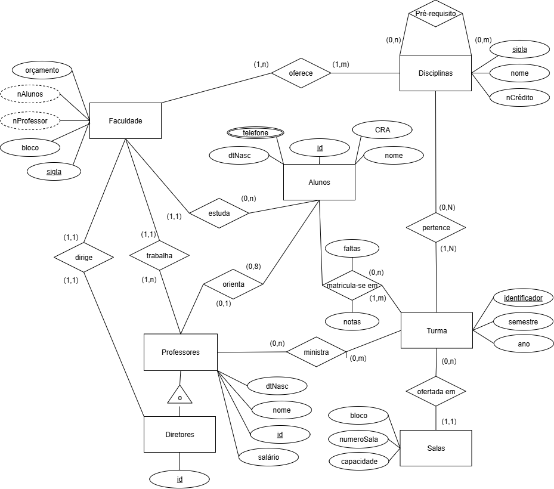
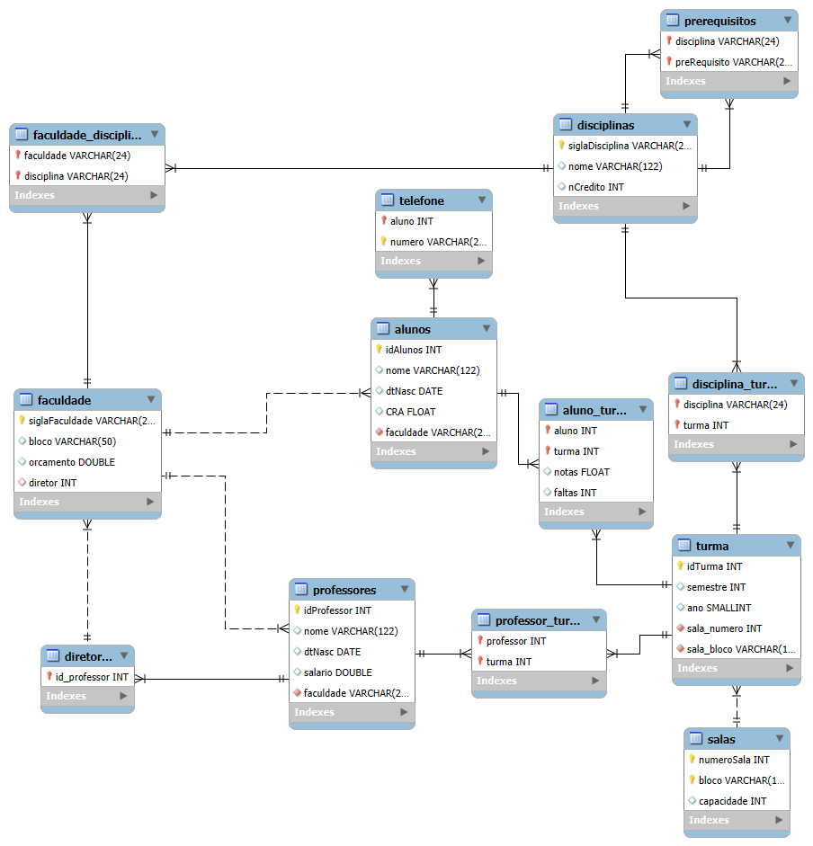

# BancoDeDados_Universidade_atividade 
## Atividade da matéria 'Laboratório de Banco de Dados' com fim de modelagem(diagrama EER) e implementação no MySQL.
* **Faculdade:** UFMS
* **Curso:** Engenharia de Software
* **Ferramentas:**
  - draw.io;
  - MySQL Workbench;
 
### Descrição:
 “A universidade está organizada em faculdades. Cada faculdade é
 identificada por uma identificação exclusiva (sigla), está situado em um bloco específico,
 número de professores, número de alunos e possui um orçamento. A faculdade possui um
 diretor, que é um dos seus professores. Cada faculdade tem uma lista de disciplinas que
 ele oferece. Cada disciplina possui uma sigla, nome e número de créditos. Uma disciplina
 pode ter várias disciplinas como pré-requisito. Uma disciplina por ser pré-requisito de
 várias disciplinas. Os professores são identificados por um identificador numérico único
 e as informações guardadas são seu nome, data de nascimento e salário. Um professor
 está vinculado a somente uma faculdade. Alunos são identificados por um identificador
 numérico exclusivo e as informações guardadas são seu nome, data de nascimento, CRA e
 telefones. Um aluno é vinculado a uma faculdade da universidade, A universidade mantém
 uma lista de salas de aulas especificando o nome do bloco, o número da sala e a capacidade
 das salas. Para uma disciplina ser ministrada, é preciso abrir uma turma para ela. Para
 as turmas são armazenadas a identificação da turma (por exemplo, turma SA, SB, A),
 semestre, ano. Também deve ser armazenado o local onde a turma será ministrada. Os
 professores quando ministram a disciplina são associados às turmas. Uma turma pode
 ter mais de um professor. Os alunos, durante o período de matrícula, se matriculam 
 nas turmas ofertadas no semestre corrente. Ao final do curso, são guardadas as informações
 das notas e faltas dos alunos. Os alunos podem fazer iniciação científica com um professor
 e o professor pode orientar no máximo 8 alunos.”
 ### Modelagem:
 * #### **Modelo Conceitual**-EER
 <!--* ;-->

  

* #### **Modelo Lógico**
 <!--* ;-->

  

* #### **Modelo Físico**
  - [Documento Script SQL](./universidade.sql)
 
⚠ **Atenção**: Material com fins de aprendizado, e assim sendo, pode conter **erros** e **insconsistências**.

* ### **Links e material de apoio** 📖
 - [Curso Banco de Dados - Metropole Digital]([./universidade.sql](https://materialpublic.imd.ufrn.br/curso/disciplina/3/73/8/6))
 - [Tipos de dados MySQL](https://pt.myservername.com/mysql-data-types-what-are-different-data-types-mysql#goog_rewarded)
 - **WELLING**, Luke; **THOMSON**, Laura. **PHP e MySQL: Desenvolvimento Web**. 5. ed. Rio de Janeiro: Campus/Elsevier, 2010.

 
    

